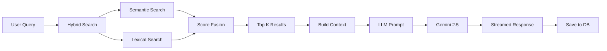

# RAG Pipeline

**Retrieval-Augmented Generation (RAG)** is the core of VectorOps. This document explains how user queries are transformed into grounded, cited AI responses.

---

## What is RAG?

Traditional LLMs rely only on their training data, which:
- ❌ Can be outdated
- ❌ May hallucinate facts
- ❌ Lacks your specific domain knowledge

RAG solves this by:
1. **Retrieving** relevant information from your knowledge base
2. **Augmenting** the LLM prompt with this context
3. **Generating** a response grounded in retrieved facts

---

## Pipeline Overview



**Time breakdown:**
- Hybrid search: ~7 seconds (6.5s semantic + 0.5s lexical)
- Context building: <100ms
- LLM generation: 2-5 seconds
- **Total: 9-12 seconds**

---

## Stage 1: Query Reception

### Entry Point
```typescript
// server/src/routes/chat.ts
export async function POST(req: NextRequest) {
  const { messages, sessionId } = await req.json();
  const userMessage = messages[messages.length - 1].content;
  
  console.log('[chat] request started:', { sessionId, query: userMessage });
  
  // Proceed to retrieval...
}
```

**Input:**
- User's latest message
- Session ID for context tracking
- Full message history (not used in search, but available)

---

## Stage 2: Hybrid Search

### Algorithm: 70% Semantic + 30% Lexical

```typescript
// lib/hybridSearch.ts
export async function hybridSearch(query: string, topK = 5) {
  const startTime = Date.now();
  
  // Run both searches in parallel
  const [semanticResults, lexicalResults] = await Promise.all([
    semanticSearch(query),
    lexicalSearch(query)
  ]);
  
  // Normalize and merge
  const merged = normalizeAndMerge(semanticResults, lexicalResults, 0.7, 0.3);
  
  // Sort and deduplicate
  const ranked = merged
    .sort((a, b) => b.score - a.score)
    .slice(0, topK);
  
  console.log('[hybridSearch] completed:', {
    duration: Date.now() - startTime,
    results: ranked.length
  });
  
  return ranked;
}
```

---

### 2A: Semantic Search (ChromaDB)

**Purpose:** Find chunks with similar *meaning* to the query.

**Process:**
1. **Embed the query** using Jina API
   ```typescript
   const queryVector = await embedTexts([query]);
   // Returns: [768-dimensional vector]
   ```

2. **Search ChromaDB** by cosine similarity
   ```typescript
   const collection = await getOrCreateCollection('vectorops');
   const results = await collection.query({
     queryEmbeddings: queryVector,
     nResults: 10
   });
   ```

3. **Return scored results**
   ```typescript
   return results.documents.map((doc, i) => ({
     text: doc,
     score: results.distances[i], // Cosine distance (0-1)
     filePath: results.metadatas[i].filePath,
     chunkIndex: results.metadatas[i].chunkIndex
   }));
   ```

**Example:**
- Query: "What is deep learning?"
- Finds chunks about: "neural networks", "backpropagation", "layers"
- Even if exact phrase "deep learning" isn't present

**Timing:** 6-7 seconds (ChromaDB Cloud API)

---

### 2B: Lexical Search (MiniSearch)

**Purpose:** Find chunks with exact *keyword* matches.

**Process:**
1. **Build in-memory index** (done on first search)
   ```typescript
   const miniSearch = new MiniSearch({
     fields: ['text'],
     storeFields: ['text', 'filePath', 'chunkIndex'],
     searchOptions: {
       boost: { text: 2 },
       fuzzy: 0.2
     }
   });
   
   // Add all chunks from ChromaDB
   miniSearch.addAll(allChunks);
   ```

2. **Search with BM25 algorithm**
   ```typescript
   const results = miniSearch.search(query, { prefix: true });
   // BM25 score considers:
   // - Term frequency (TF)
   // - Inverse document frequency (IDF)
   // - Document length normalization
   ```

3. **Return scored results**
   ```typescript
   return results.map(r => ({
     text: r.text,
     score: r.score, // BM25 score (0-∞)
     filePath: r.filePath,
     chunkIndex: r.chunkIndex
   }));
   ```

**Example:**
- Query: "What is deep learning?"
- Finds chunks with: "deep", "learning", "deep learning"
- High scores for exact matches

**Timing:** 50-100ms (in-memory)

---

### 2C: Score Fusion

**Purpose:** Combine semantic and lexical scores into a single ranking.

**Algorithm:**
1. **Normalize scores** to 0-1 range
   ```typescript
   function normalize(results: SearchResult[]) {
     const maxScore = Math.max(...results.map(r => r.score));
     return results.map(r => ({
       ...r,
       score: maxScore > 0 ? r.score / maxScore : 0
     }));
   }
   ```

2. **Weighted merge** (70% semantic, 30% lexical)
   ```typescript
   const semanticWeight = 0.7;
   const lexicalWeight = 0.3;
   
   const combined = new Map();
   
   for (const result of normalizedSemantic) {
     const key = `${result.filePath}:${result.chunkIndex}`;
     combined.set(key, {
       ...result,
       score: result.score * semanticWeight
     });
   }
   
   for (const result of normalizedLexical) {
     const key = `${result.filePath}:${result.chunkIndex}`;
     const existing = combined.get(key);
     
     if (existing) {
       // Boost score if found in both
       existing.score += result.score * lexicalWeight;
     } else {
       combined.set(key, {
         ...result,
         score: result.score * lexicalWeight
       });
     }
   }
   ```

3. **Sort by combined score**
   ```typescript
   const ranked = Array.from(combined.values())
     .sort((a, b) => b.score - a.score)
     .slice(0, topK);
   ```

**Why 70/30?**
- Semantic is more important for understanding intent
- Lexical catches exact terms that semantic might miss
- Empirically tested ratio (can be tuned)

---

## Stage 3: Context Building

### Convert Chunks to Prompt Context

```typescript
// server/src/routes/chat.ts
const contextText = ragResults
  .map((r, i) => 
    `[Source ${i + 1}: ${r.filePath}]\n${r.text}`
  )
  .join('\n\n---\n\n');

console.log('[chat] context built:', { 
  length: contextText.length,
  sources: ragResults.length 
});
// Example: { length: 4360, sources: 5 }
```

**Example Context:**
```
[Source 1: knowledge/ai-in-general.md]
# Machine Learning

Machine learning is a subset of artificial intelligence that enables systems to learn from data...

---

[Source 2: knowledge/ai-in-general.md]
## Neural Networks

Neural networks are computing systems inspired by biological neural networks...

---

[Source 3: knowledge/ml-algorithms.md]
Deep learning uses multiple layers of neural networks to learn hierarchical representations...
```

**Limits:**
- Maximum 5 sources by default
- Typically 3,000-5,000 characters
- Fits well within Gemini's 1M token context window

---

## Stage 4: LLM Prompt Construction

### System Prompt
```typescript
const systemPrompt = `You are a helpful AI assistant with access to a knowledge base.

Answer the user's question using ONLY the information provided in the context below.

Context:
${contextText}

Instructions:
- Answer accurately based on the context
- If the answer isn't in the context, say "I don't have information about that"
- Be concise but thorough
- Cite sources when possible
`;
```

### User Message
```typescript
const userPrompt = userMessage; // Original query
```

---

## Stage 5: LLM Generation

### Streaming with Gemini

```typescript
import { streamText } from 'ai';
import { google } from '@ai-sdk/google';

const result = streamText({
  model: google('gemini-2.5-flash'),
  system: systemPrompt,
  messages: [{ role: 'user', content: userPrompt }],
  temperature: 0.7,
  maxTokens: 1000
});

return result.toDataStreamResponse();
```

**Model:** Gemini 2.5-flash
- **Why?** Fast, cost-effective, good quality
- **Alternatives:** GPT-4, Claude, Llama 3

**Temperature: 0.7**
- Lower = More deterministic
- Higher = More creative
- 0.7 = Balanced for factual Q&A

**Max Tokens: 1000**
- Limits response length
- ~750 words typically

---

## Stage 6: Response Storage

### Save to MongoDB

```typescript
// Save user message
await saveMessage({
  sessionId,
  role: 'user',
  content: userMessage
});

// Save assistant response (after streaming completes)
await saveMessage({
  sessionId,
  role: 'assistant',
  content: fullResponseText,
  citations: ragResults.map(r => ({
    filePath: r.filePath,
    chunkIndex: r.chunkIndex
  }))
});
```

**Why save citations?**
- Enable "show sources" feature
- Track which knowledge is being used
- Audit trail for responses

---

## Complete Code Flow

```typescript
// server/src/routes/chat.ts
export async function POST(req: NextRequest) {
  const { messages, sessionId } = await req.json();
  const query = messages[messages.length - 1].content;
  
  // 1. Retrieve
  const ragResults = await hybridSearch(query, 5);
  
  // 2. Build context
  const contextText = ragResults
    .map((r, i) => `[Source ${i + 1}: ${r.filePath}]\n${r.text}`)
    .join('\n\n---\n\n');
  
  // 3. Generate
  const result = streamText({
    model: google('gemini-2.5-flash'),
    system: `Context:\n${contextText}\n\nAnswer based on context.`,
    messages,
    temperature: 0.7
  });
  
  // 4. Save (in background)
  result.onFinish(async ({ text }) => {
    await saveMessage({ sessionId, role: 'user', content: query });
    await saveMessage({ 
      sessionId, 
      role: 'assistant', 
      content: text,
      citations: ragResults.map(r => ({
        filePath: r.filePath,
        chunkIndex: r.chunkIndex
      }))
    });
  });
  
  // 5. Stream to client
  return result.toDataStreamResponse();
}
```

---

## Performance Optimization

### Current Bottlenecks
1. **ChromaDB API latency** (6-7s)
   - Solution: Use ChromaDB self-hosted or Pinecone
2. **MiniSearch rebuild** (every request)
   - Solution: Cache index in Redis
3. **Sequential flow**
   - Already optimized: Searches run in parallel

### Potential Improvements

**1. Caching**
```typescript
const cached = await redis.get(`search:${hash(query)}`);
if (cached) return JSON.parse(cached);

const results = await hybridSearch(query);
await redis.set(`search:${hash(query)}`, JSON.stringify(results), 'EX', 300);
```

**2. Streaming Retrieval**
```typescript
// Start LLM generation before all chunks arrive
const semanticStream = semanticSearchStream(query);
for await (const chunk of semanticStream) {
  if (sufficientContext(chunk)) {
    startLLMGeneration(chunk);
  }
}
```

**3. Re-ranking**
```typescript
// After hybrid search, re-rank with cross-encoder
const reranked = await rerank(query, hybridResults);
const topK = reranked.slice(0, 5);
```

---

## Quality Monitoring

### Metrics to Track

**Retrieval Quality:**
- Precision@K: How many retrieved chunks are relevant?
- Recall@K: How many relevant chunks were retrieved?
- MRR (Mean Reciprocal Rank): Position of first relevant result

**Generation Quality:**
- Groundedness: Does response match context?
- Answer relevance: Does it answer the question?
- Citation accuracy: Are citations correct?

### Logging for Analysis
```typescript
console.log('[rag-metrics]', {
  query,
  retrievalTime: searchDuration,
  generationTime: llmDuration,
  chunksUsed: ragResults.length,
  contextLength: contextText.length,
  responseLength: response.length,
  citationsCount: citations.length
});
```

---

## Advanced RAG Techniques

### Not Yet Implemented (Future)

**1. HyDE (Hypothetical Document Embeddings)**
- Generate a hypothetical answer first
- Embed and search with it
- Better for complex queries

**2. Query Expansion**
- Rewrite query in multiple ways
- Search with all variations
- Merge results

**3. Maximal Marginal Relevance (MMR)**
- Penalize redundant results
- Increase diversity
- Cover more aspects of the query

**4. Conversational Context**
- Use previous messages in retrieval
- Track conversation topics
- Improve follow-up questions

---

## Troubleshooting

### "No relevant results found"
**Causes:**
- Knowledge base is empty
- Query is too specific
- Embeddings not generated

**Solutions:**
1. Check ChromaDB: `await collection.count()`
2. Test with broad query: "what is this about?"
3. Re-ingest documents

### "Response doesn't match context"
**Causes:**
- LLM hallucinating
- Context too large/confusing
- System prompt needs tuning

**Solutions:**
1. Lower temperature (0.3-0.5)
2. Simplify system prompt
3. Reduce context length
4. Add explicit instruction: "DO NOT make up information"

### "Search is too slow"
**Solutions:**
1. Reduce `topK` to 3
2. Skip lexical search for faster results
3. Use ChromaDB self-hosted
4. Cache search results

---

**See also:**
- [Architecture](./architecture.md) for system design
- [API Reference](./api-reference.md) for endpoint details
- [Hybrid Search Paper](https://arxiv.org/abs/2210.11416) for theory
