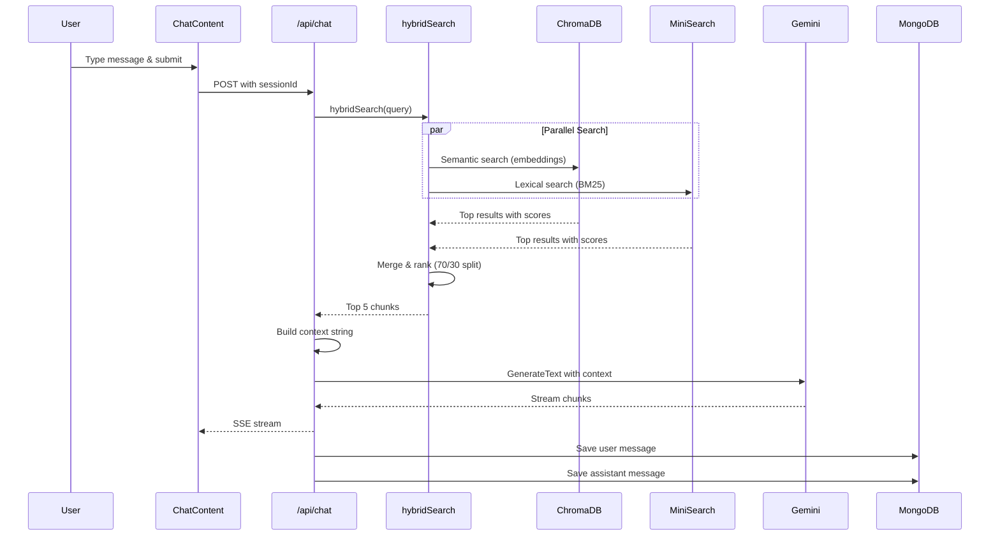
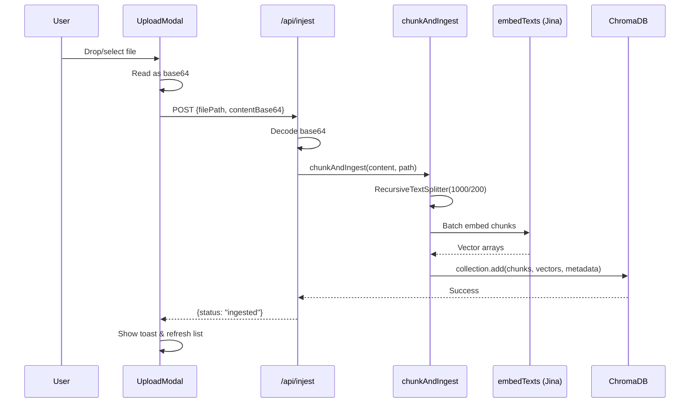

# System Architecture

## Overview

VectorOps is a **MERN RAG application** built with React (Vite) and Express with three main architectural layers:

```
┌─────────────────────────────────────┐
│         Frontend (React)            │
│  - Chat UI                          │
│  - File Upload Modal                │
│  - Session Management               │
└──────────────┬──────────────────────┘
               │ HTTP/SSE
┌──────────────▼──────────────────────┐
│         Express API                │
│  - Chat endpoint (streaming)        │
│  - Session CRUD                     │
│  - File ingestion                   │
└──────────────┬──────────────────────┘
               │
      ┌────────┴────────┐
      │                 │
┌─────▼─────┐    ┌─────▼─────┐
│  MongoDB  │    │ ChromaDB  │
│  (Chat)   │    │ (Vectors) │
└───────────┘    └───────────┘
```

---

## System Diagram

```mermaid
graph TB
    subgraph "Client Layer"
        A[Browser]
        B[Chat UI]
        C[Upload Modal]
        D[Sidebar]
    end

    subgraph "API Layer"
        E[/api/chat - Streaming]
        F[/api/sessions]
        G[/api/messages]
        H[/api/injest]
        I[/api/knowledge]
    end

    subgraph "Business Logic"
        J[hybridSearch]
        K[chunkAndIngest]
        L[embedTexts - Jina]
        M[streamText - Gemini]
    end

    subgraph "Data Layer"
        N[(MongoDB)]
        O[(ChromaDB Cloud)]
        P[MiniSearch - In-Memory]
    end

    A --> B
    A --> C
    A --> D
    
    B --> E
    B --> F
    B --> G
    C --> H
    C --> I
    D --> F
    D --> G

    E --> J
    E --> M
    F --> N
    G --> N
    H --> K
    I --> O

    J --> O
    J --> P
    K --> L
    K --> O
    M --> N
```

---

## Component Architecture

### Frontend Components

```
App (ToastProvider)
    ├── ChatLayout
    │   ├── Sidebar (ChatSidebar)
    │   │   ├── Session List
    │   │   └── UploadModal
    │   └── Outlet
    │       ├── /chat (Landing)
    │       └── /chat/:id (ChatContent)
    └── Routes
            ├── / (Landing)
            └── /docs (Docs)
```

**Key Component Patterns:**
- **useToast** - Global notification system
- **useChat** - AI SDK hook for streaming

---

## Data Flow Architecture

### 1. Chat Request Flow



**Timing Breakdown:**
- Hybrid search: ~7 seconds
- Gemini generation: ~2-5 seconds
- Total response: ~9-12 seconds

---

### 2. File Ingestion Flow



**Chunking Strategy:**
- **Chunk size**: 1000 characters
- **Overlap**: 200 characters
- **Why?** Balances context completeness with search precision

---

## Database Schemas

### MongoDB Collections

#### `sessions`
```typescript
{
  _id: ObjectId,
  title: string,          // "New Chat" or first message preview
  createdAt: Date,
  updatedAt: Date
}
```

#### `messages`
```typescript
{
  _id: ObjectId,
  sessionId: ObjectId,    // References sessions._id
  role: "user" | "assistant",
  content: string,
  citations?: Array<{
    filePath: string,
    chunkIndex: number
  }>,
  createdAt: Date
}
```

### ChromaDB Collection

#### `vectorops` (default collection)
```typescript
{
  id: string,             // UUID
  embedding: number[],    // 768-dimensional vector from Jina
  metadata: {
    filePath: string,     // "knowledge/ai-in-general.md"
    chunkIndex: number,   // 0, 1, 2, ...
    text: string          // Original chunk text
  }
}
```

---

## External Services

### 1. ChromaDB Cloud
- **URL**: `api.trychroma.com`
- **Purpose**: Vector storage and semantic search
- **Auth**: API key in `CHROMA_API_KEY`
- **Collection**: Single collection named "vectorops"

### 2. Jina AI Embeddings
- **URL**: `api.jina.ai/v1/embeddings`
- **Model**: `jina-embeddings-v2-base-en`
- **Dimensions**: 768
- **Why Jina?** Free tier, reliable, better than Gemini for embeddings

### 3. Google Gemini
- **Model**: `gemini-2.5-flash`
- **Purpose**: Chat completion with streaming
- **Rate Limit**: 20 requests/minute (free tier)
- **Context Window**: ~1M tokens (we use ~4KB)

### 4. MongoDB Atlas
- **Purpose**: Persistent chat history
- **Database**: `vectorops`
- **Collections**: `sessions`, `messages`

---

## Design Decisions

### Why Hybrid Search?

| Method | Pros | Cons |
|--------|------|------|
| **Semantic Only** | Understands meaning | Misses exact keywords |
| **Lexical Only** | Fast, exact matches | No context understanding |
| **Hybrid (70/30)** | ✅ Best of both | Slightly more complex |

**Example:**
- Query: "What is machine learning?"
- Semantic finds: "ML algorithms", "neural networks"
- Lexical finds: exact phrase "machine learning"
- Hybrid combines both for best results

### Why Jina over Gemini Embeddings?

1. **Gemini embedContent** had 404 errors on v1beta
2. Jina has a stable, generous free tier
3. Jina v2 base is optimized for English text
4. 768 dimensions is sufficient for our use case

### Why Stream Responses?

Better UX:
- User sees progress immediately
- No waiting for entire response
- Feels more conversational

Technical:
- Uses `streamText()` from AI SDK
- Server-Sent Events (SSE) transport
- Chunks arrive as they're generated

---

## Scalability Considerations

### Current Architecture (Good for 1-100 users)
- ✅ Express API with Node.js
- ✅ Managed databases (MongoDB Atlas, ChromaDB Cloud)
- ⚠️ MiniSearch is in-memory (rebuilt on each search)

### Future Scaling (100+ users)
1. **Cache MiniSearch index** in Redis
2. **Add rate limiting** per user
3. **Queue ingestion** jobs (BullMQ)
4. **Split collections** by user/workspace

---

## Security

### Current Implementation
- API keys in `server/.env` (not committed)
- Server-side only (no client exposure)
- MongoDB connection via SSL

### Production Checklist
- [ ] Add authentication (NextAuth.js)
- [ ] Rate limit API routes
- [ ] Sanitize file uploads (virus scanning)
- [ ] CORS configuration
- [ ] Content Security Policy headers

---

## Performance Metrics

| Operation | Average Time | Notes |
|-----------|--------------|-------|
| Semantic search | 3-4s | ChromaDB query |
| Lexical search | 50-100ms | In-memory MiniSearch |
| Embedding generation | 200-500ms | Jina API (per batch) |
| Gemini streaming | 2-5s | Depends on response length |
| File ingestion | 1-3s | Depends on file size |

**Total chat response time: 9-12 seconds**

---

## Deployment Architecture

```
Vercel (Frontend + API)
    ↓
MongoDB Atlas (Chat History)
    ↓
ChromaDB Cloud (Vectors)
    ↓
Jina AI (Embeddings)
    ↓
Google Gemini (LLM)
```

**All services are serverless and auto-scale.**

---

## Error Handling

### Toast Notification System
- ✅ API quota exceeded
- ✅ Network failures
- ✅ File upload errors
- ✅ Chat deletion confirmations

### Logging Strategy
```typescript
// Pattern: [namespace] message
console.log('[chat] request started:', { sessionId });
console.log('[hybridSearch] completed:', { duration: 7234 });
console.error('[embeddings] failed:', error);
```

---

## Next Steps

To extend this architecture:
1. **Add authentication** → User-specific collections
2. **Multi-tenancy** → Workspace isolation
3. **Advanced RAG** → Re-ranking, HyDE, query expansion
4. **Analytics** → Track search quality and user satisfaction

---

**See also:**
- [RAG Pipeline](./rag-pipeline.md) for detailed retrieval flow
- [API Reference](./api-reference.md) for endpoint specifications
